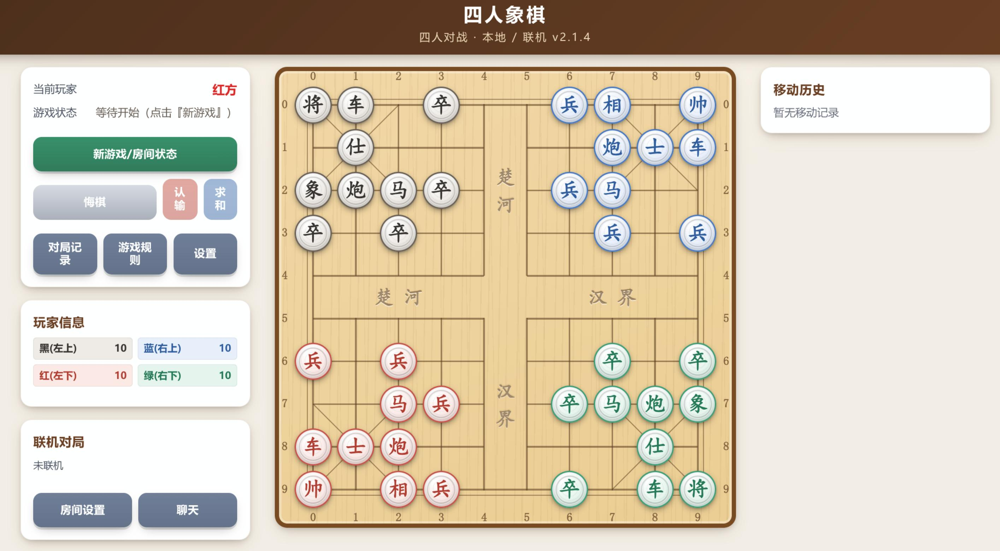
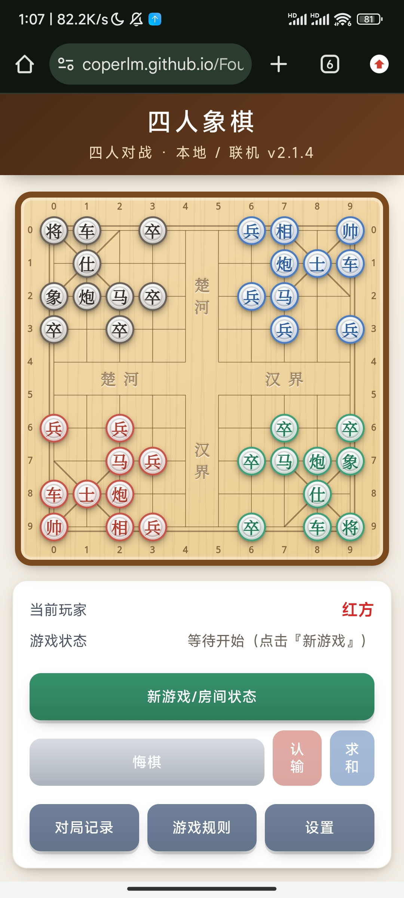

# Four-way-Xiangqi

纯前端的支持1-4人的变体中国象棋，支持免服务器联机（基于WebRTC P2P+Trystero），已部署到 GitHub Pages。





## 功能

- **两种对局方式**：`本地对战`（同一设备轮流操作四个颜色）、`联机对战`（创建房间后，用邀请链接加入）。
- **两种对战模式**：`两两组队`（红蓝 vs 绿黑，对角线是队友）、`四人混战`（各自为战，按死亡顺序排 1–4 名）。
- **胜利条件**：`吃将任意一方即结束`（默认）/ `仅剩一队`。
- **友伤**：可开关`允许吃队友棋子`。
- **求和**：对局中可提议和棋（本地直接和；联机需其余玩家全部同意）。
- **悔棋 / 吃子**：可多次悔棋，每次记入独立的「悔棋记录」；吃子托盘按颜色展示被吃棋子。
- **设置**：深色模式、音效（默认开启），自动保存。
- **记谱**：走子显示为两位数字坐标（如 `95` 即第 9 列第 5 行；10×10 下每位都是一位数，无需分隔符）。
- **对局回放**：导出为单行编码，导入后按当前「记谱方式」列出走法、逐手查看、可点击跳转。
- **联机容错**：房主刷新自动续局；房主掉线 20 秒后由在线玩家自动接任。
- **响应式**：桌面 / 平板 / 安卓手机自适应（窄屏单列、棋盘置顶、触摸友好）。

## 联机对战（免服务器）
1. 项目已部署到 [GitHub Pages](https://coperlm.github.io/Four-way-Xiangqi/)。
2. 一人点 **新游戏 → 联机对战 → 创建房间**，点 **复制邀请链接** 并分享给其他人。
3. 其他人 **打开该邀请链接**（`...?room=xxxx`）即自动加入房间。
4. 房主选 **对战模式 / 胜利条件 / 友伤**，点 **开始 / 重开对局**。

## 规则

- 棋盘 10×10，中间横竖两条"楚河汉界"为分隔线（不可落子）；四角 5×5 为四家区域（红左下 / 蓝右上 / 绿右下 / 黑左上）。
- 棋子走法同传统象棋：帅/将（九宫直一格）、士/仕（九宫斜一格）、相/象（走田不过河、塞象眼）、马（走日、蹩马腿）、车（直线）、炮（隔一子吃）、兵/卒（**未过河只前进，过河后可前进+侧移，永不后退**；每个兵朝向由初始位置固定）。
- **命名**：红+蓝用「帅/士/相/兵」，绿+黑用「将/仕/象/卒」。
- **将军不强制应对**：被将军时仍可自由走子；若所选走法走完后本方仍/会被将军，会弹窗二次确认（能解将的走法不弹窗）。只有「将/帅被吃」或「困毙（完全无子可动）」才出局；本变体不采用「将帅照面」规则。
- 详见游戏内「游戏规则」。

## 联机要点

- 房主校验每手并广播"走子"，其他端用同一套规则复核后再落子；非法走子会被拒绝并请求重同步。没有中立后端，无法从根本上阻止房主改自己浏览器；本作为朋友局定位。
- 身份使用用本机 `localStorage` 中的 token 识别（故换设备/清缓存等于新身份）。
- 房主状态随时存本地，刷新后自动重连同一房间续局；失联超时由在线玩家中 `selfId` 最小者接任。
- 联机信令走公共网络，个别网络环境下可能连不上；无 TURN 时少数 NAT 打不通。

## 对局回放

- 导出：`对局记录 → 导出回放`，得到一个单行编码文件 `.xq4`。
- 导入：`对局记录 → 导入回放`，底部出现控制条可逐手查看、可点击跳转。
- 文件内含加盐哈希签名：文件被改动过会校验失败、直接拒绝导入。

## 项目架构

```
index.html                 # 页面 + 弹窗
styles/style.css           # 全部样式（主题/棋盘/弹窗/响应式）
js/
  utils/Config.js          # 棋盘/角色/命名/规则常量
  utils/Utils.js           # 工具函数
  utils/GameStatePersistence.js  # 本地存档（含规则）
  game/GameState.js        # 棋盘状态、规则数据、淘汰与排名
  game/RuleValidator.js    # 走法合法性
  game/GameEngine.js       # 流程编排（UI/胜负/历史）
  game/Replay.js           # 回放导出/导入/校验
  board/{BoardRenderer,CoordinateMapper,PieceManager}.js
  net/OnlineSession.js     # 联机（Trystero P2P，房主权威）
  ui/GameInterface.js      # 界面与弹窗
  main.js                  # 入口
vendor/trystero.nostr.iife.js  # 打包后的 Trystero（无需 CDN）
server.js                  # 局域网静态服务器（可选）
test/                      # Node 测试（规则/联机协议/回放/随机化压力）
```

## 开发

最初版本是 [coperlm](https://github.com/coperlm) 和他的小笨模型写的，然后一大堆bug，最后修不好了然后只能暂时扔一边了；于 2026/10/04 使用 Qwen 3.8 Max 大范围重构，使用 DeepSeek V4.1flash 完善细节并修复 bug，最终于 2026/10/06 完成 `v2.1.4` 可用版本。

欢迎 Pr 和 Issue。

## 许可

MIT
